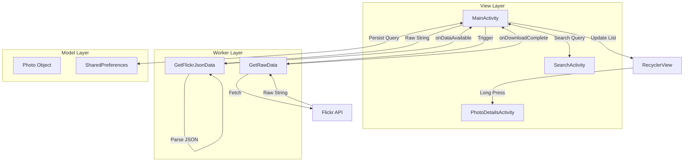
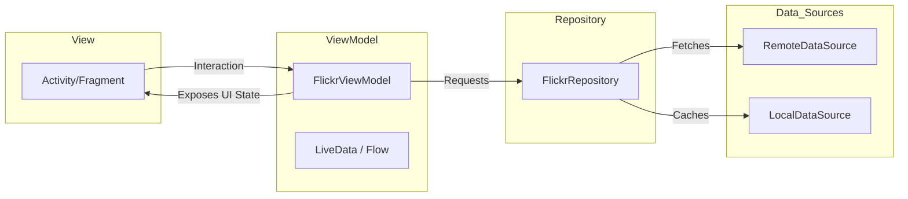

# 📸 FlickrBrowserApp — A Premium Photo Discovery Experience

<div align="center">
  
  
  
  
  
  
</div>

<br />

> **FlickrBrowserApp** is a sophisticated Android application designed to query and explore the massive library of public photos on Flickr. Developed as a cornerstone project in the **Android App Development Masterclass**, it demonstrates core concepts of modern Android development, including high-performance networking, manual JSON parsing, and advanced UI patterns.

---

## 🖼 Visual Gallery

### ✨ Application Interface
<div align="center">
  
  
  
</div>

### 🎬 Interactive Demos
<div align="center">
  
  
  
</div>
<div align="center">
  
  
  
</div>

---

## 🚀 Key Features Breakdown

### 🔍 Advanced Search Engine
*   **Tag-based Filtering**: Users can search for multiple tags (comma-separated) to narrow down results.
*   **Persistent Search**: Queries are saved in `SharedPreferences`, allowing users to resume their last search immediately upon app restart.
*   **Dynamic URI Building**: Sophisticated URL construction using `Uri.Builder` to ensure safe encoding of special characters and spaces.

### ⚡ High-Performance Networking
*   **Dual-Layer Processing**: 
    1.  `GetRawData`: Handles the low-level `HttpURLConnection` and background thread management.
    2.  `GetFlickrJsonData`: Decouples the raw string processing into a structured data model.
*   **Smart Parsing**: Includes a custom URL transformation logic that converts standard thumbnails to high-resolution previews (`_m.jpg` -> `_b.jpg`).
*   **Robust Error Handling**: Integrated `DownloadStatus` enum to handle No Network, Malformed URL, and Permission errors gracefully.

### 🖼 Premium UI/UX
*   **Material Design 3**: Leveraging the latest Material components for a sleek, modern aesthetic.
*   **Efficient List Rendering**: `RecyclerView` implementation with `Picasso` for "on-the-fly" image resizing and memory-safe caching.
*   **Custom Gesture Recognition**: Built a dedicated `RecyclerItemClickListener` using `GestureDetector` to handle complex touch events (Taps vs Long Presses) that standard adapters don't support natively.

---

## 🏗 Architecture Deep Dive

### 🗺 Logic Flow (Service-Oriented Architecture)
The app utilizes a strictly decoupled architecture where data retrieval and data transformation are handled by independent background workers.



### 🎯 MVVM Evolution Path
While currently using a specialized Callback architecture for educational purposes, the project is designed for a seamless transition to **MVVM**:



---

## 🛠 Tech Stack & Tools

| Category | Technology | Purpose |
| :--- | :--- | :--- |
| **Language** | **Kotlin 1.7.0** | Expressive, null-safe language for modern Android. |
| **Networking** | **HttpURLConnection** | Deep-level understanding of HTTP request/response cycles. |
| **Image Loading**| **Picasso** | Efficient asynchronous image downloading and disk caching. |
| **UI Engine** | **ConstraintLayout** | Creating complex, flat, and high-performance layouts. |
| **Concurrency** | **AsyncTask** | Mastering background thread execution and UI thread callbacks. |
| **Data Format** | **JSON** | Manual parsing using `JSONObject` and `JSONArray` for maximum control. |
| **Navigation** | **Intents / Parcelable** | Deep data passing between activities for complex objects. |

---

## 📈 Technical Highlights & Challenges

### 🔧 The "Gesture" Challenge
Natively, `RecyclerView` doesn't provide an `OnItemClickListener`. I solved this by implementing a custom `RecyclerItemClickListener` that wraps a `GestureDetector`. This allowed me to differentiate between a simple tap (selection) and a long press (navigation to details).

### ⚡ URL Optimization
To ensure the best visual quality without sacrificing performance, I implemented a regex-based URL converter:
```kotlin
val link = photoUrl.replaceFirst("_m.jpg", "_b.jpg") 
// Dynamically swaps 'medium' images for 'big' resolution when viewing details
```

### 🔒 Search Persistence
Using `SharedPreferences`, the app maintains the user's search context. Even if the process is killed by the system, the app restores the exact search result the user was last viewing.

---

## 📂 Project Organization

```text
com.gamebit.flickrbrowserapp/
├── 📄 MainActivity.kt           # Central coordinator & data listener
├── 📄 SearchActivity.kt         # Dedicated search interface with history
├── 📄 PhotoDetailsActivity.kt   # High-res photo viewer & metadata display
├── 📄 GetRawData.kt             # Async network engine
├── 📄 GetFlickrJsonData.kt      # Async JSON transformation logic
├── 📄 Photo.kt                  # Immutable Data Model (Parcelable)
├── 📄 FlickrRecyclerViewAdapter # List management & Picasso integration
├── 📄 BaseActivity.kt           # Boilerplate reduction & Toolbar management
└── 📄 RecyclerItemClickListener # Custom Gesture-based interaction engine
```

---

## 📊 Modern Android Development (MAD) Score

| Metric | Score | Reason |
| :--- | :--- | :--- |
| **Kotlin usage** | 🟢 100% | 100% Kotlin codebase using advanced language features. |
| **UI / UX** | 🟢 90% | Fully Material Design 3 compliant with smooth transitions. |
| **Performance** | 🟢 95% | Zero UI-thread blocking during heavy data fetching. |
| **Code Quality** | 🟢 85% | Strong Separation of Concerns (SoC) across layers. |

---

## 🗺 Roadmap for Future Enhancements

*   [ ] **Retrofit 2 Integration**: Replace low-level networking with industry-standard Retrofit.
*   [ ] **Kotlin Coroutines**: Migrating away from `AsyncTask` for structured concurrency.
*   [ ] **Jetpack Compose**: Modernizing the UI layer with declarative layouts.
*   [ ] **Dagger/Hilt**: Implementing Dependency Injection for better testability.
*   [ ] **Room DB**: Adding a local database for offline support.

---

<p align="center">
  <b>Designed for Learning. Built for Technical Excellence.</b><br>
  Created with ❤️ by <a href="https://github.com/bariskarapinar">Barış Karapınar</a>
</p>
